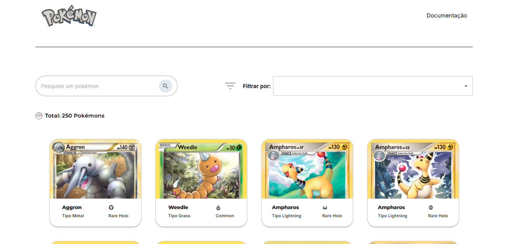

# 🔍 Pokémon 

Aplicação desenvolvida com React e Vite para listar Pokémons consumindo dados da Pokémon TCG API. O app permite busca em tempo real e exibe detalhes visuais e funcionais de cada Pokémon.



---

## 🚀 Funcionalidades

- 🔎 Busca dinâmica por nome do Pokémon
- 📋 Listagem visual com nome, imagem e tipos
- 🧠 Detalhes básicos do Pokémon (via API)
- 📱 Design responsivo para desktop e mobile
- ⚡ Leve e rápido, utilizando Vite como bundler

---

## 🛠️ Tecnologias utilizadas

- **React.js**
- **Vite**
- **Material-UI**
- **Pokémon TCG-API** (https://pokemontcg.io/)

---

## 💻 Como rodar o projeto localmente

```bash
# Clone o repositório
git clone https://github.com/A1AD10/pokemon.git

# Acesse a pasta do projeto
cd pokemon

# Instale as dependências
npm install

# Rode o projeto
npm run dev
```
## 🌐 Link para acesso online

➡️ [pokemon-weld-mu.vercel.app](https://pokemon-weld-mu.vercel.app)

---

## 📌 Observações

Este projeto foi desenvolvido como exercício prático de consumo de API, integração de componentes e responsividade.

Futuras melhorias podem incluir:
- Detalhes estendidos dos Pokémons
- Rolagem infinita
- Animações

---

## 👨‍💻 Desenvolvedor

**Aladio Vanderlei de Lima Junior**  
🔗 [LinkedIn](https://www.linkedin.com/in/aladio-junior285) | 🌐 [Portfólio](https://meu-portfolio-opal-pi.vercel.app)

